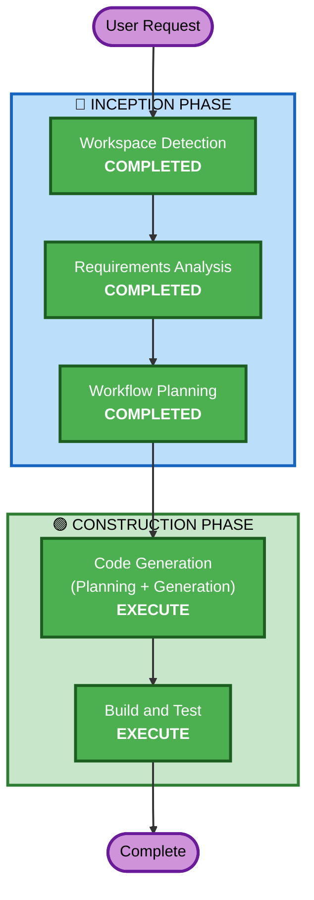

# Execution Plan — Player Death & Respawn: Disable Visuals and Colliders

## Detailed Analysis Summary

### Transformation Scope
- **Transformation Type**: Single component enhancement
- **Primary Changes**: PlayerCombat.cs (death/respawn logic), PlayerController.cs (bug fix)
- **Related Components**: PlayerVisual, HurtBox (prefab children — no script changes needed)

### Change Impact Assessment
- **User-facing changes**: Yes — player now disappears on death and reappears on respawn
- **Structural changes**: No — using existing architecture and patterns
- **Data model changes**: No
- **API changes**: No
- **NFR impact**: No — network consistency maintained via existing Fusion patterns

### Risk Assessment
- **Risk Level**: Low — isolated changes to well-understood components
- **Rollback Complexity**: Easy — revert 2 files
- **Testing Complexity**: Simple — manual playtest in Unity Editor

## Workflow Visualization

## Phases to Execute

### 🔵 INCEPTION PHASE
- [x] Workspace Detection (COMPLETED)
- [x] Requirements Analysis (COMPLETED)
- [x] Workflow Planning (COMPLETED)
- User Stories — SKIP
  - **Rationale**: Single-feature enhancement, no multiple personas or complex user journeys
- Application Design — SKIP
  - **Rationale**: No new components or services; changes within existing PlayerCombat/PlayerController boundaries
- Units Generation — SKIP
  - **Rationale**: Single unit of work, no decomposition needed

### 🟢 CONSTRUCTION PHASE
- Functional Design — SKIP
  - **Rationale**: Simple logic changes, no new business rules or data models
- NFR Requirements — SKIP
  - **Rationale**: No new NFR concerns; existing Fusion networking patterns sufficient
- NFR Design — SKIP
  - **Rationale**: NFR Requirements skipped
- Infrastructure Design — SKIP
  - **Rationale**: No infrastructure changes
- [ ] Code Generation — EXECUTE
  - **Rationale**: Implementation of death visual/collider disable, respawn re-enable, invincibility timer, and ChangePlayerEnable bug fix
- [ ] Build and Test — EXECUTE
  - **Rationale**: Verify compilation and provide test instructions

## Success Criteria
- **Primary Goal**: Player disappears on death, reappears on respawn with brief invincibility
- **Key Deliverables**: Modified PlayerCombat.cs, PlayerController.cs
- **Quality Gates**: Zero compile errors, networked state consistency across clients
